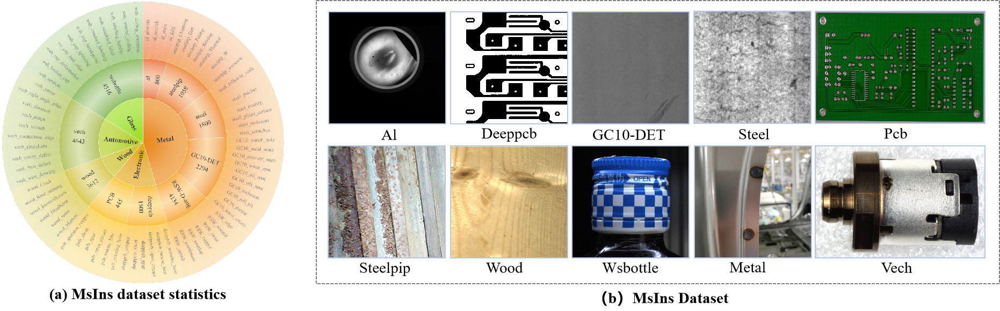

# Multi-IDD: A Real-World Multi-Task Dataset for Benchmarking Industrial Defect Detection

## Abstract

Industrial defect detection aims to locate and identify known defects (object detection) or detect unknown anomalies (anomaly detection) to ensure the stability and reliability of product quality. However, the scarcity of defect samples and narrow task compatibility in existing industrial defect detection datasets constrain model training and limit their broader applicability across different detection tasks. To address these challenges, we propose two substantial datasets: the Glass Container defect detection (GC) dataset and the Multi-scene Industrial defect detection (MsIns) dataset. These datasets feature large-scale, real-world defect samples and support multiple detection tasks. The GC dataset, sourced from actual production lines, consists of 100k high-resolution, multi-view images covering three object shapes, three structural categories, and five defect types. The MsIns dataset integrates 10 existing datasets into a unified collection of 28k images, encompassing 76 defect types. With numerous microscopic industrial defects and significant variations in defect scales, there is a need for more powerful detection methods. To this end, we introduce the Cross-scale Context-aware Aggragation (C^2A) module, which enhances the extracted features by incorporating two key components: the cross-scale aware block and the adaptive context aggragation block. Moreover, we present a comprehensive benchmarking analysis to evaluate the performance of existing methods on these datasets in the context of industrial defect detection. 

## Download Datasets

Kaggle: [GC(od)](https://drive.google.com/file/d/19KMM8YQasQuuBEun-qaS_wBSc03Npf5R/view?usp=sharing), [GC(ad)](https://drive.google.com/file/d/15EkvLsmj_2PEBsOGCcwlwAbpum6_NHF3/view?usp=sharing), [MsIns(od)](https://drive.google.com/file/d/1PV-XmHUJh9jNL_tmjEalAklir_o1OL_9/view?usp=sharing), [MsIns(ad)](https://drive.google.com/file/d/1Taz7N8LIjGgQiQ-kbvQ_aJQKGoTuHDtV/view?usp=sharing)
         

## Datasets
**GC dataset**

Class：bubble，plastering thread，black spot，oil， quenched grain

（a） Innermost layer: tasks components, middle layer: subtasks composition, outermost layer: object categories. GC includes 2 key tasks and 100k images.
（b） Illustration of diverse data collection and sample images from the GC dataset.

**MsIns dataset**

（a）Innermost layer: products components, middle layer: subproducts composition, outermost layer: object categories. MsIns covers 10 key subproducts and 76 representative categories of IDD.
（b） Sample images from the MsIns.
